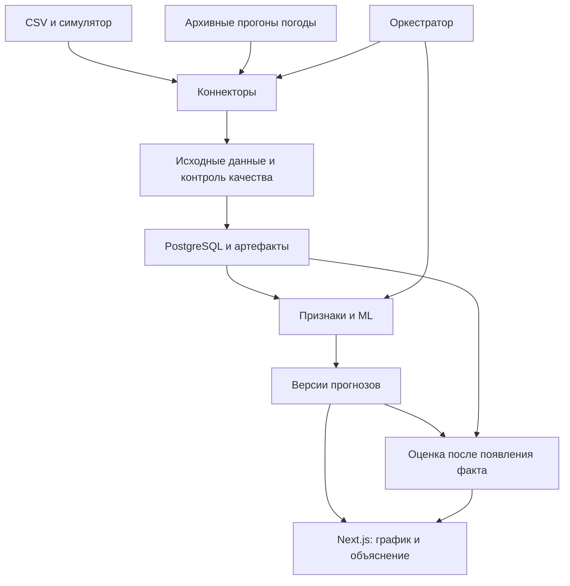

# Техническое задание
# AI-платформа прогнозирования выработки ВЭС

Версия: 1.1 · Дата: 23.09.2026

Основание: задание HackAlem «Agentic AI для прогнозирования выработки ВЭС», исследование research-wind-forecast.md и согласованная архитектура wind-platform-architecture.md.

Уточнение стека от заказчика: всё приложение реализуется на Next.js и TypeScript, база данных — PostgreSQL. Это уточнение заменяет выбор Python/FastAPI/CatBoost в исходной архитектуре.

Документ определяет MVP для хакатона и границы последующего развития. Статус документа — готов к декомпозиции и реализации; открытые параметры из раздела 15 необходимо зафиксировать до итогового бэктеста. Описание требований не означает, что функционал уже реализован.

## 1. Назначение и результат

Разработать платформу, которая загружает историю работы ВЭС, самостоятельно получает доступный на момент расчёта прогноз погоды, рассчитывает почасовую нормализованную мощность на 24 или 48 часов, анализирует результат и повторяет расчёт при обновлении входных данных.

Пользователь должен видеть прогноз, происхождение данных, версию модели, качество входов и причины изменения результата. Система должна воспроизводить последовательные расчёты за февраль 2026 без использования информации, которая стала известна после момента соответствующего прогноза.

Целевой объект MVP: одна ВЭС и две турбины. Поддержка отдельных прогнозов турбин зависит от фактической гранулярности целевой мощности: если мощность измерена на общей линии, основной объект прогнозирования — линия/станция, а измерения турбин служат признаками. Нельзя представлять общую мощность как два независимых измерения.

Ожидаемые результаты поставки: исходный код, работающий интерфейс, импорт данных, погодный адаптер, ML-модель и baseline, агентный цикл, бэктест, экспорт прогнозов, документация запуска и проверки.

## 2. Объём MVP и приоритеты

P0 — обязательно для сдачи MVP. P1 — дополнение после завершения P0. P2 — промышленное развитие.

| Функция | Приоритет |
|---|---|
| Каталог ВЭС/турбин и настройка временной шкалы | P0 |
| Импорт CSV, сопоставление полей, контроль качества | P0 |
| Архивный погодный коннектор и хранение исходных ответов | P0 |
| Baseline, модель на TypeScript, временная валидация | P0 |
| Прогноз на 24/48 часов и история версий | P0 |
| Автоматический агентный цикл и журнал инструментов | P0 |
| Бэктест февраля и CSV-экспорт | P0 |
| Дашборд, источники, журнал агента | P0 |
| Симуляция поступления новых данных | P0 |
| Docker Compose и воспроизводимый запуск | P0 |
| Рабочий коннектор PostgreSQL как внешнего источника | P1 |
| Квантили P10/P50/P90 и проверка покрытия | P1 |
| MySQL, Oracle, MongoDB | P2 |
| SCADA, AVEVA/PI/Historian и промышленный шлюз | P2 |
| JMineOps и модели для горной отрасли | P2 |

Коннекторы P1/P2 можно показывать в каталоге с явным статусом «Запланировано». Они не должны имитировать успешное подключение. Управление оборудованием, расчёт финансовой экономии, полноценная диагностика неисправностей и многоклиентский SaaS не входят в MVP.

## 3. Пользователи и доступ

| Роль | Права |
|---|---|
| Администратор | Настройка объектов, источников, сопоставления полей, пользователей и параметров выполнения |
| Аналитик/оператор | Просмотр данных, запуск прогноза и бэктеста, сравнение версий, экспорт |
| Наблюдатель | Просмотр дашборда, прогнозов и отчётов |

В MVP допускается один заранее созданный пользователь-администратор без самостоятельной регистрации. Авторизация обязательна при доступе через сеть. Полное управление ролями можно отложить до P1; серверная модель прав должна учитывать будущие роли. Учётные данные задаются через переменные окружения, не фиксируются в репозитории.

## 4. Технологическая архитектура

| Слой | Технология и ответственность |
|---|---|
| Приложение | Next.js + TypeScript: интерфейс, сессии, Route Handlers, серверная бизнес-логика |
| Коннекторы | Серверные TypeScript-модули Next.js: CSV, погодный HTTP API, последующие адаптеры |
| Расчёты | Серверные TypeScript-модули: признаки, обучение, прогноз, оценка и агентный цикл |
| ML в MVP | Регуляризованная линейная регрессия на нелинейных признаках и эмпирическая кривая мощности; реализация на TypeScript |
| База | PostgreSQL: доменные данные, версии, очередь заданий и аудит |
| Артефакты | Постоянный том: исходные CSV, ответы API, параметры моделей, отчёты |
| Развёртывание | Docker Compose: один Next.js-сервис в Node.js runtime и PostgreSQL |

Весь прикладной код находится в одном Next.js-проекте. Отдельные Python/FastAPI-сервисы не используются. Версии зависимостей фиксируются lock-файлом. Расчёты выполняются на сервере в Node.js runtime; секреты и обучающие данные не передаются в браузер. Edge runtime не используется для обучения и файловых операций.

Долгие задачи разбиваются на ограниченные по времени возобновляемые шаги: импорт порциями, обработка одного погодного прогона, построение признаков порциями, ограниченное число итераций обучения, один момент выпуска бэктеста. Каждый шаг сохраняет checkpoint в PostgreSQL. Защищённый `POST /api/internal/jobs/tick` атомарно получает задачу, выполняет один шаг и фиксирует прогресс. Внутренний endpoint вызывает системный планировщик; для локальной демонстрации поставляется Node.js-скрипт-диспетчер из того же проекта, вызывающий endpoint. Диспетчер не содержит ML или бизнес-логики.

Планировщик продолжает работу при закрытом браузере. Обработка после отправки HTTP-ответа через незавершённый Promise не допускается. Бюджет шага конфигурируется под среду размещения; при превышении шаг возобновляется из checkpoint. Одновременно выполняется не более одного тяжёлого расчётного шага на экземпляр MVP. Таймауты, дублирующиеся вызовы планировщика и истечение lease учитываются как штатные ситуации.

Начальная целевая среда — постоянно работающий Node.js-сервер с постоянным томом. Serverless-развёртывание требует отдельной проверки лимитов выполнения, планировщика и замены локального тома постоянным хранилищем; оно не считается автоматически совместимым с данным MVP.

Рекомендуемая структура одного проекта:

| Путь | Назначение |
|---|---|
| `src/app/` | Страницы и layouts |
| `src/app/api/v1/` | Публичные Route Handlers с проверкой сессии |
| `src/app/api/internal/jobs/tick/` | Защищённый запуск шага задачи |
| `src/server/connectors/` | Адаптеры источников |
| `src/server/data/` | Валидация, агрегация, снимки и временная доступность |
| `src/server/ml/` | Baseline, признаки, обучение, прогноз и оценка |
| `src/server/agent/` | Оркестрация, инструменты и объяснения |
| `src/server/jobs/` | Очередь, lease, checkpoint и повторы |
| `src/server/db/` | Доступ к PostgreSQL и миграции |
| `scripts/` | Диспетчер, импорт и команды воспроизведения |
| `tests/` | Приёмочные проверки критических правил |

Серверные модули не импортируются в клиентские компоненты. Численные циклы выполняются малыми порциями с передачей управления event loop между порциями; отзывчивость интерфейса проверяется одновременно с расчётом. Если этого недостаточно, допускается Node.js Worker Thread с тем же TypeScript-кодом в рамках Next.js-сервиса, без отдельного backend-приложения.



## 5. Функциональные требования

### FR-01. Каталог объектов

Хранить станцию и связанные объекты: идентификатор, название, тип, координаты, исходный часовой пояс, единицы, номинальная мощность при наличии, правило нормализации. Координаты валидировать по допустимым диапазонам. Числовые координаты должен подтвердить пользователь; URL карты не является координатой для API.

Критерий: импортированные ряды однозначно связаны с объектом; неизвестный объект не создаётся молча.

### FR-02. Импорт истории

Загрузка CSV с настройкой кодировки, разделителя, десятичного разделителя, формата времени и объекта. Автоопределение допустимо только с предпросмотром и подтверждением. Минимальные поля по заданию: время, скорость ветра, нормализованная активная мощность, температура. Точные исходные заголовки задаются через mapping, не зашиваются в расчётную логику.

Импорт должен сохранять исходный файл, SHA-256, параметры преобразования и отчёт: число прочитанных, принятых, отклонённых, повторных строк и причины ошибок. Повторный импорт того же файла с тем же mapping не удваивает измерения. Исправленные значения создают ревизию.

При загрузке файла, содержащего февраль 2026, целевые значения теста выделяются в evaluation-only набор. Наличие тестового факта в CSV не даёт права использовать его в обучении или признаках.

Критерий: пользователь видит результаты импорта и может скачать отклонённые строки с причинами.

### FR-03. Контроль качества и времени

Проверять пропуски, дубликаты, типы, единицы, порядок времени, диапазоны и свежесть. Отдельно настроить смысл метки времени: начало/конец интервала, а также правила агрегации исходной частоты до часа.

Средняя мощность и энергия — разные величины: для средней мощности использовать подходящую временную агрегацию, для энергии — суммирование. Направление ветра агрегировать с учётом цикличности, если оно присутствует. Неполный час маркировать; порог достаточности покрытия хранить в конфигурации.

Пропуски нельзя автоматически заменять нулём. Выбросы сохранять с флагом, исключения из обучения документировать. Параметры заполнения пропусков обучать только на тренировочной части.

Критерий: расчёт не запускается на неизвестной временной шкале или несовместимых единицах; причина доступна в интерфейсе.

### FR-04. Коннекторы

Общий интерфейс: `test_connection`, `discover_schema`, `fetch_batch(cursor, window)`, `normalize`, `health`. Объявляемые возможности: `history`, `incremental`, `stream`, `forecast_runs`. Для погоды добавить `list_runs(as_of)` и `fetch_run(run_id)`.

Настройка: выбрать тип → проверить доступ → выбрать данные → сопоставить поля → указать время/единицы → проверить пример → включить. Для CSV проверяется доступность и формат файла вместо сетевого подключения.

Адаптер хранит курсор, последнюю успешную синхронизацию и ошибку. Курсор обновляется после надёжного сохранения данных. Секреты маскируются в UI и журнале. AI-предложение сопоставления полей является P1 и требует подтверждения пользователя.

Критерий: новый адаптер подключается через контракт без изменения ML-модели при сохранении канонической схемы.

### FR-05. Архивная погода

Первый кандидат — Open-Meteo Single Runs / ECMWF IFS HRES. Конкретные поля, даты, высоты и момент публикации проверяются запросами до утверждения адаптера. Выбор кандидата не считается доказательством наличия всех необходимых данных.

Сохранять источник, модель, координаты, время инициализации, время доступности, целевой час, время скачивания, единицы, raw-ответ и его хеш. На момент T разрешены только прогоны с `available_at <= T`. Время инициализации не заменяет время доступности.

Если время исторической публикации неизвестно, применяется явно указанная консервативная задержка с основанием и согласованием методики. Такой прогон маркируется как использующий допущение. Фактическая будущая погода не может быть резервом архивного прогноза.

Проверять покрытие всех целевых часов. Неполный прогноз не публиковать как полный. При сетевом сбое использовать сохранённый допустимый прогон либо завершать задачу с понятной причиной.

### FR-06. Обучение и выбор модели

Реализовать минимум один baseline, не требующий недоступных в режиме теста данных, и обучаемую регрессионную модель на TypeScript. Persistence допускается только при доступном последнем измерении. Альтернатива — обученная на истории кривая мощности и допустимый прогноз ветра.

Основная модель MVP — ridge-регрессия на нелинейных признаках: ветер, квадрат и куб ветра, температура, взаимодействия ветра с температурой, циклические признаки времени, объект и горизонт. Масштабирование, коэффициенты, регуляризация и параметры постобработки сохраняются как JSON-артефакт модели. Обучение выполняется итерационно с checkpoint, ограничением числа итераций и проверкой сходимости; NaN/Infinity и вырожденные данные должны приводить к диагностируемой ошибке. Параметры масштабирования вычисляются только на тренировочном наборе.

Это стартовая модель, выбранная для полностью TypeScript-реализации, а не обещание качества CatBoost. Если она уступает эмпирической кривой мощности на временной валидации, рабочей становится лучшая допустимая модель. Более сложные модели на JavaScript/TypeScript относятся к P1 после проверки совместимости и качества.

Сформировать признаки из прогнозной погоды, времени, объекта и горизонта. Наблюдаемые лаги разрешены только до T и только в разрешённом режиме данных. Не использовать будущий факт, включая заполнение пропусков из будущего.

Сравнить окна 3/6/12 месяцев и всю доступную совместную историю на временной валидации до февраля; для недостаточного окна записать причину пропуска. Использовать минимум три последовательных валидационных окна, если объём совместных данных позволяет. Модель и baseline оценивать на одинаковых парах выпуска и целевого часа.

Фиксировать период обучения, признаки, seed, параметры, версию кода, версии входов и метрики. Февраль не используется для подбора гиперпараметров. Для MVP модель после допустимого обучения фиксируется; автоматическое дообучение на феврале выключено.

Критерий: опубликован отчёт сравнения и воспроизводимый артефакт модели. Цель качества — меньшая MAE основной модели относительно baseline на общей валидационной выборке. Если цель не достигнута, результат указывается честно, лучшая допустимая модель может стать рабочей; улучшение не считается доказанным.

### FR-07. Формирование прогноза

Вход: объект(ы), момент выпуска T, горизонт 24 или 48, режим данных, версия модели. Выход: по одному значению на каждый целевой час и объект прогнозирования.

Хранить `issued_at`, `created_at`, `target_time`, `lead_hour`, значение, единицу, модель, погодный прогон, снимок входов, статус и связь с предыдущей версией. В бэктесте `issued_at` — исторический T, `created_at` — фактическое время выполнения.

Правило целевых часов должно явно учитывать начало/конец часового интервала. До утверждения временной конвенции итоговый экспорт имеет статус чернового.

Не ограничивать значения диапазоном [0,1], пока такая нормализация не подтверждена. В МВт/МВт·ч переводить только после получения нужных параметров. Для нормировки на номинал: `P_MW = p_norm × P_nom_MW`, `E_MWh = P_MW × duration_hours`; формула применима только при подтверждённой семантике `p_norm`.

### FR-08. Агентный цикл

Триггеры: ручной запуск, расписание, новый допустимый погодный прогон, новые разрешённые измерения. Серверный оркестратор Next.js выполняет получение данных → проверку → признаки → прогноз → проверку результата → сохранение → объяснение → ожидание обновления.

Реализовать инструменты `fetch_weather_run`, `validate_inputs`, `build_features`, `predict`, `compare_forecasts`, `evaluate_when_actuals_arrive`, `explain` с типизированными входами и выходами. Оркестратор может выбрать резервный допустимый прогон, повтор запроса, baseline или остановку с причиной. Ограничения времени и публикации проверяет код.

LLM получает разрешённые инструменты и структурированные сводки. Решение LLM не может разрешить недопустимый источник, изменить метрику или обойти проверку временной доступности. При сбое LLM расчёт продолжается с шаблонным объяснением.

Повторы ограничены: проектный default — не более трёх попыток сетевого действия с увеличением интервала; параметры вынесены в конфигурацию. Бесконечный цикл вызовов запрещён. Переобучение не запускается автоматически при каждом новом погодном прогоне.

Критерий: одно обновление создаёт новую версию без ручного запуска; повтор того же события не создаёт дубликат. Каждый шаг и выбор инструмента отражён в журнале.

### FR-09. Объяснение результата

Брифинг содержит: период и объект; основной прогноз; изменение относительно предыдущей версии на общих целевых часах; изменившиеся входы; ограничения качества; ссылки на расчёт и погодный прогон.

Числа берутся из расчётных результатов и проверяются перед публикацией. Утверждения о влиянии признака допускаются только с подтверждающим анализом; иначе показывается наблюдаемое изменение входных данных без заявления о причинности. «Поломка» или «обледенение» без подтверждающих измерений не выдаются как установленный факт.

### FR-10. Бэктест

Один и тот же расчётный код используется в обычном запуске и в бэктесте; меняется источник времени и политика доступа к данным.

Обучающий cutoff — не позднее 31.01.2026 и не позднее момента доступности данных для первого выпуска. Целевой период оценки — 01–28.02.2026. Выпуски выполняются последовательно с 31.01.2026 по согласованному расписанию. Мартовские хвосты сохраняются, но в февральские метрики не входят.

По умолчанию факт февраля доступен только оценщику. Разрешение использовать уже наступивший февральский факт как лаг оформляется отдельной конфигурацией и основанием от организаторов. При этом `available_at <= T` остаётся обязательным, обучение на феврале остаётся выключенным.

Метрики: MAE и RMSE, отдельно по объектам, горизонтам 1–24 и 25–48 часов и в целом; дополнительно официальная метрика после уточнения. Хранить N оцениваемых пар, долю покрытых пар, исключения и их причины. При N=0 отображать «Нет данных», а не нулевую ошибку.

MAE = mean(abs(y − y_hat)); RMSE = sqrt(mean((y − y_hat)^2)). Нормализованные ошибки требуют явно заданного знаменателя. MAPE не является обязательной метрикой из-за возможной нулевой мощности.

Экспортные столбцы по умолчанию: `asset_id, issued_at, target_time, lead_hour, prediction, unit, model_version, weather_run_id, forecast_run_id, status`. Формат организаторов реализуется отдельным преобразованием после его получения.

### FR-11. Симуляция обновлений

Режим replay управляет виртуальным временем и последовательно открывает доступ к подготовленным событиям. Интерфейс постоянно показывает «Симуляция». Прогнозы replay не смешиваются с реальными запусками и официальным бэктестом.

Критерий: демонстрация показывает минимум два допустимых набора входов, автоматический пересчёт и сохранение обеих версий.

## 6. Интерфейс

Язык MVP — русский. Интерфейс рассчитан на desktop от 1280 px; при меньшей ширине таблицы допускают горизонтальную прокрутку. Все времена снабжены обозначением часового пояса, значения — единицами.

| Экран | Обязательные элементы |
|---|---|
| Обзор ВЭС | Объекты, последний прогноз, свежесть источников, качество данных, активная задача, явный режим работы |
| Прогноз | Фильтры объекта/выпуска/горизонта; график; таблица; доступный факт; предыдущая версия; брифинг; экспорт |
| Источники | Тип, статус, последнее обновление, ошибка, настройка CSV/mapping, предпросмотр, отчёт качества |
| Журнал агента | Запуски, шаги, выбранные инструменты, причины решений, длительность, ошибки и ссылки на результат |

На экране прогноза или отдельной вкладке разместить запуск бэктеста и отчёт метрик. Состояния интерфейса: загрузка, пусто, ошибка, частичные данные, устаревшие данные, готово. При сбое нового расчёта последний успешный прогноз остаётся доступен с датой выпуска и предупреждением об устаревании.

## 7. Данные и хранение

| Сущность | Обязательное содержание |
|---|---|
| `assets` | Тип объекта, связь со станцией, координаты, часовой пояс, шкала мощности |
| `connections`, `field_mappings` | Тип, возможности, настройки, mapping, ссылка на секрет, курсор |
| `raw_artifacts`, `imports` | Хеш, путь, источник, параметры импорта, отчёт |
| `observations` | Объект, показатель, значение, единица, event_time, available_at, ingested_at, ревизия, флаг качества |
| `weather_runs`, `weather_values` | Времена прогона/публикации/скачивания, целевой час, модель, значения и raw_ref |
| `model_versions` | Артефакт, версия кода, признаки, cutoff, параметры и метрики |
| `input_snapshots` | Неизменяемый набор ссылок на ревизии измерений, погоду, конфигурацию и хеш |
| `forecast_runs`, `forecast_values` | Момент выпуска, режим, снимок, модель, статусы и почасовые результаты |
| `jobs`, `agent_events` | Состояние, lease, heartbeat, checkpoint, число попыток, шаги и причины |
| `evaluation_runs`, `metrics` | Окна, политика данных, прогнозы, факт, метрики, покрытие |

Все временные значения в БД — UTC. Исходный часовой пояс сохраняется в метаданных. Неизвестная доступность не подменяется незаметно: у допущения должны быть тип, параметры и основание.

Уникальность прогнозной точки: `forecast_run_id + asset_id + target_time`. Идемпотентность расчёта: объект/набор объектов + issued_at + горизонт + input_snapshot_hash + model_version + режим + версия конфигурации. Старые версии не перезаписываются.

## 8. API

Внешний префикс — `/api/v1`. Браузер обращается к Route Handlers Next.js. Доступ к внутреннему endpoint диспетчеризации защищён отдельным секретом, проверяемым на сервере; браузер его не вызывает.

| Метод и путь | Назначение |
|---|---|
| `GET /assets`, `POST /assets` | Список и создание объектов |
| `POST /imports` | Загрузка файла и параметров импорта |
| `GET /imports/{id}` | Отчёт обработки |
| `GET /connections`, `POST /connections` | Список и настройка источников |
| `POST /connections/{id}/test` | Проверка источника |
| `POST /training-jobs` | Запуск обучения по разрешённому cutoff |
| `POST /forecast-jobs` | Создание прогноза |
| `POST /backtest-jobs` | Запуск воспроизводимого бэктеста |
| `GET /jobs/{id}` | Статус, прогресс, ошибка и ссылка на результат |
| `GET /forecasts` | Фильтр по объекту, выпуску, режиму и горизонту |
| `GET /forecasts/{id}/export` | Экспорт CSV |
| `GET /evaluations/{id}` | Метрики, baseline, покрытие |
| `GET /agent-runs/{id}` | Журнал шагов |
| `POST /api/internal/jobs/tick` (вне префикса v1) | Выполнить ограниченный шаг фоновой задачи; доступ только диспетчеру |
| `GET /health` | Готовность приложения без секретов |

Долгие операции возвращают HTTP 202 и `job_id`. Повтор с тем же `Idempotency-Key` и телом возвращает существующую задачу; тот же ключ с другим телом — 409. Ошибка содержит `code`, `message`, `request_id`, безопасные `details`; stack trace не отправляется пользователю.

Пример запроса прогноза; идентификаторы условные:

```json
{
  "asset_ids": ["turbine-1", "turbine-2"],
  "issued_at": "2026-01-31T12:00:00Z",
  "horizon_hours": 48,
  "mode": "backtest",
  "model_version": "approved-model",
  "data_policy": "history_only"
}
```

Время в примере не задаёт официальное расписание. Конкретная версия модели разрешается и фиксируется при создании задачи. Произвольное переданное имя не даёт доступа к неизвестному артефакту.

## 9. Надёжность, безопасность и производительность

- Состояния задач: queued → running → succeeded / failed / cancelled. Потеря heartbeat возвращает задачу на ограниченный повтор; частичный результат не публикуется как готовый.
- Получение задания атомарно. Результат и статус готовности фиксируются согласованно; сбой между ними не должен создавать две опубликованные версии.
- Все входные параметры проверяются на сервере. Максимальный размер файла настраивается; начальный предел — 100 МБ. Неподдерживаемый формат возвращает понятную ошибку.
- Доступ к промышленным источникам только на чтение. Произвольный SQL и команды оборудования не предоставляются LLM.
- Секреты — в переменных окружения/хранилище секретов. В журнале не сохраняются пароли, токены и строки подключения с секретами. При сетевом развёртывании используется HTTPS.
- PostgreSQL и артефакты размещаются на постоянных томах. Документировать резервное копирование и восстановление; для хакатона достаточно команд backup/restore и проверки одного восстановления.
- UI показывает прогресс длительных задач. API принимает задачу за целевое время до 2 секунд при отсутствии внешних сетевых операций внутри запроса.
- Проектная цель: прогноз 48 часов для двух объектов на загруженной модели и локальных входах — до 60 секунд на машине 4 CPU / 8 ГБ RAM. Это целевой критерий, не измеренный результат. Обучение и скачивание архива измеряются отдельно.
- Метрики выполнения: время расчёта, число сбоев/повторов, возраст источника, покрытие данных. Для MVP достаточно структурированных логов и таблиц состояния.

## 10. Воспроизводимость

Репозиторий должен содержать README, `.env.example` без секретов, compose-файл, миграции, закреплённые зависимости, конфигурацию модели/бэктеста, небольшой разрешённый демонстрационный набор и тесты критических правил.

Задать команды или эквивалентные документированные скрипты:

- `docker compose up --build` — запуск окружения;
- `make import` — импорт подготовленных файлов;
- `make train` — обучение по конфигурации;
- `make backtest` — расчёт тестового периода;
- `make export` — экспорт результатов;
- `make verify` — критические проверки.

Это интерфейс требуемой поставки, а не утверждение о наличии скриптов сейчас. В README указать подготовку `.env`, пути данных, сетевые зависимости, длительность запуска по фактическим измерениям и ограничения лицензий на исходные материалы.

Снимок входов и метаданные должны позволять воспроизвести числа без повторного запроса внешнего API. При невозможности распространять архив приложить процедуру его получения и контрольные суммы. Допуск сравнения результатов фиксируется для выбранного окружения; проектный начальный допуск — 1e-6 абсолютной разницы в нормализованной шкале. Точное совпадение текста LLM не требуется.

## 11. Приёмочные сценарии

| ID | Проверка | Ожидаемый результат |
|---|---|---|
| AC-01 | Импорт корректного CSV | Значения и время соответствуют предпросмотру; отчёт содержит число строк |
| AC-02 | Повторный импорт | Нет удвоения измерений |
| AC-03 | Пропуски, неверные единицы, дубликаты | Ошибки отмечены; нули не подставлены автоматически |
| AC-04 | Погодный прогон опубликован после T | Прогон отклонён, причина записана |
| AC-05 | Февральский факт доступен только оценщику | Изменение будущего факта не меняет прогнозы, выпущенные до его доступности |
| AC-06 | Запуск на 24/48 часов | Ровно 24/48 валидных часовых точек на целевой объект либо явный статус неполноты без публикации полного прогноза |
| AC-07 | Новый допустимый погодный прогон | Автоматически сохранена новая версия и сравнение на общих часах |
| AC-08 | Повтор одного события | Повторная опубликованная версия не создаётся |
| AC-09 | Недоступен погодный API | Применён допустимый кэш/резерв или понятная ошибка; будущий факт не использован |
| AC-10 | Недоступен LLM | Числовой прогноз доступен, показано шаблонное объяснение |
| AC-11 | Next.js перезапущен в середине задачи | Задача восстановлена или завершена ошибкой; нет двойной публикации |
| AC-12 | Повтор бэктеста на том же снимке | Числа совпадают в заданном допуске |
| AC-13 | Отчёт оценки | MAE/RMSE, baseline, N, покрытие и исключения воспроизводятся из экспорта |
| AC-14 | Запрос без разрешённой сессии | Доступ к защищённым данным отклонён |
| AC-15 | Запуск на чистом окружении | Команда проходит по README и получает демонстрационный прогноз |
| AC-16 | Недоказанная или неизвестная единица мощности | Интерфейс не показывает МВт/МВт·ч и не суммирует несовместимые нормализованные ряды |

MVP принимается при прохождении P0-сценариев, наличии отчёта качества модели и отсутствии незафиксированных допущений о времени/данных. Цель превосходства над baseline оценивается отдельно: функциональная работоспособность сама по себе не подтверждает улучшение прогноза.

## 12. Этапы разработки

| Этап | Содержание | Зависимость | Результат |
|---|---|---|---|
| E1 | Проверить данные, координаты, шкалу и время | Исходные материалы | Зафиксированный контракт данных |
| E2 | Поднять окружение, БД, импорт и raw-хранилище | E1 | История доступна через API |
| E3 | Проверить архив погоды и собрать один снимок T | E1, E2 | Допустимые погодные входы |
| E4 | Baseline → прогноз → сохранение → график | E2, E3 | Полный рабочий сценарий |
| E5 | TypeScript-модель, временная валидация и версия модели | E4 | Отчёт сравнения и артефакт |
| E6 | Агент, обновления, журнал, резервные сценарии | E4 | Автономный пересчёт |
| E7 | Бэктест, экспорт, метрики, проверки утечки | E5, E6 | Результаты февраля |
| E8 | README, демонстрация, проверка поставки | E7 | Готовый MVP |

Даты и исполнители назначаются командой. Для декомпозиции желательно закрепить владельцев направлений web/API, данные/коннекторы, ML/бэктест, интеграция/документация. Сначала завершить E4, затем расширять модель и интеграции.

## 13. Демонстрация для жюри

1. Показать объекты, историю и отчёт качества импорта.
2. Выбрать исторический момент T и показать, какой погодный прогон был допустим.
3. Запустить цикл и открыть почасовой прогноз.
4. В режиме симуляции предоставить обновлённый допустимый прогон.
5. Показать автоматическую новую версию и объяснение изменений.
6. Открыть бэктест, baseline, метрики и происхождение конкретной прогнозной точки.
7. Показать команду воспроизведения и экспорт.

## 14. Последующее развитие

P1: более сложная ML-модель на TypeScript при подтверждённом улучшении, внешний PostgreSQL-коннектор, расширенные роли, квантили с проверкой покрытия, анализ вклада признаков и дополнительные погодные источники при доказанной архивной доступности.

P2: промышленные адаптеры, локальный сборщик с буфером, исходящая защищённая передача, объектное хранилище, управление моделью-кандидатом и рабочей моделью, мониторинг дрейфа и новые отраслевые модули.

Общее ядро переиспользуется. Каждая новая отрасль требует собственного определения цели, признаков, ограничений и процедуры оценки; наличие коннектора не делает модель автоматически пригодной для другого производства.

## 15. Открытые параметры и правила решения

| Параметр | Действие до финальной сдачи | Поведение до уточнения |
|---|---|---|
| Схема и содержание CSV | Проверить актуальные файлы обеих турбин | Mapping настраивается; точные заголовки не утверждаются |
| Координаты и целевой объект | Подтвердить числовые координаты и уровень измерения мощности | Прогноз по неподтверждённому объекту не считается итоговым |
| Нормализация мощности | Получить формулу и номинал | Использовать исходную шкалу без перевода в МВт |
| Часовой пояс и временная метка | Подтвердить timezone и начало/конец интервала | Требовать явную конфигурацию при импорте |
| Время выпуска и частота пересчёта | Согласовать расписание организаторов | Демонстрационное расписание помечается отдельно |
| Доступность архивной погоды | Проверить модель, поля, горизонт и publication delay | Использовать только проверенные прогоны; допущения записывать |
| Использование факта февраля | Подтвердить допустимость лагов | Февраль только для оценки, обучение выключено |
| Метрика и формат сдачи | Получить официальную спецификацию | MAE/RMSE и внутренний CSV-формат |

Файлы датасетов, появившиеся в проекте, не исследовались при составлении этого ТЗ. Их фактическая схема, число строк и качество не утверждаются документом. Это обязательная работа этапа E1; отсутствие анализа не означает отсутствия самих файлов.

## 16. Основания и справочные материалы

- HackAlem_AI_Agentic_AI_для_прогнозирования_выработки_ВЭС.pdf — требования кейса.
- research-wind-forecast.md — исследование; непроверенные конкурентные сведения не являются требованиями.
- wind-platform-architecture.md — функциональная архитектура; стек заменён уточнением заказчика в настоящем ТЗ.
- https://open-meteo.com/en/docs/single-runs-api — справочная документация погодного кандидата; фактический адаптер должен пройти проверку по данным проекта.
- https://nextjs.org/docs/app/guides/self-hosting — официальное руководство по самостоятельному размещению Next.js.
- https://nextjs.org/docs/app/guides/backend-for-frontend — официальное руководство по серверным API Next.js.

При расхождениях приоритет имеют официальные правила кейса и последующие явно зафиксированные решения команды. Изменения требований оформляются новой версией ТЗ с указанием влияния на данные, расчёт и приёмку.
