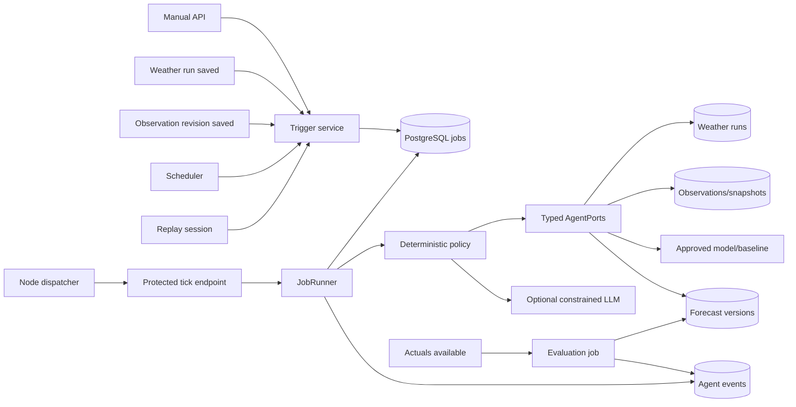

# Техническое задание: доведение агентной подсистемы до production-ready MVP

## 1. Паспорт задачи

| Поле | Значение |
|---|---|
| Система | AI-платформа прогнозирования выработки ВЭС |
| Подсистема | Агентный цикл, очередь задач, инструменты, replay и журнал решений |
| Приоритет | P0 для хакатонного MVP |
| База разработки | `origin/main` от `501839e` |
| Исходный аудит | `docs/agent-system-problems.md` |
| Стек | Next.js, TypeScript, PostgreSQL, `@openai/agents` при выбранной SDK-интеграции |
| Целевой результат | Автоматический воспроизводимый пересчёт прогноза по событию без browser-bound выполнения |

Коммиты `99ff6d1..501839e` повторно проверены: они изменяют портал, авторизацию и UI, но не устраняют зафиксированные проблемы production agent runtime.

## 2. Цель

Реализовать рабочую агентную подсистему, которая:

1. получает ручное или автоматическое событие;
2. идемпотентно создаёт durable-задачу;
3. выполняет один ограниченный шаг за один tick;
4. получает только доступные на момент выпуска данные;
5. валидирует источники, время, качество, единицы и полноту;
6. выбирает разрешённую стратегию расчёта или fallback;
7. строит и проверяет прогноз на 24/48 часов;
8. публикует новую неизменяемую версию;
9. формирует проверяемое объяснение;
10. сохраняет полный журнал шагов и причин;
11. продолжает работу после перезапуска;
12. отдельно оценивает прогноз при поступлении факта;
13. поддерживает изолированный replay с виртуальным временем.

## 3. Границы задачи

### 3.1 Входит в работу

- `src/server/agent/**` — оркестрация, policy и инструменты;
- `src/server/jobs/**` — durable queue, lease, checkpoint, retry, cancel;
- `src/server/replay/**` — replay sessions и virtual clock;
- `app/api/internal/jobs/tick/**` — выполнение одного шага;
- `app/api/v1/agent-jobs/**` — ручной запуск;
- `app/api/v1/jobs/**` — статус и отмена;
- `app/api/v1/agent-runs/**` — журнал агента;
- agent-specific PostgreSQL migrations;
- `scripts/job-dispatcher.mjs` и конфигурация dispatcher;
- agent unit/integration/E2E tests;
- раздел README о запуске агента.

### 3.2 Не входит в работу

- изменение ML-математики ridge/power-curve;
- изменение формул baseline;
- редизайн дашборда;
- новые типы промышленных коннекторов;
- обучение модели при каждом погодном событии;
- предоставление LLM произвольного SQL, shell или сетевого доступа;
- утверждение неподтверждённых единиц MW/MWh;
- изменение правил официального бэктеста.

## 4. Исходное состояние

На `main` уже существуют:

- `MemoryJobStore` и `PostgresJobStore`;
- atomic claim, lease token и fencing;
- heartbeat и checkpoint;
- ограниченные retry;
- `triggerInput` и idempotent event key;
- фиксированные шаги `fetch_weather_run` → `publish`;
- `VirtualClock` и `revealReplayEvents`;
- fixture-тесты основных инвариантов.

Не существуют или не подключены:

- production `AgentPorts`;
- production runtime `JobRunner + PostgresJobStore + AgentPorts`;
- рабочий tick;
- автоматические триггеры;
- API статуса и журнала;
- production weather tool;
- policy выбора fallback;
- отдельный evaluation workflow;
- durable replay session;
- атомарная фиксация шага и события;
- обработка heartbeat failure;
- единый контракт статусов и отмена.

## 5. Целевая архитектура



## 6. Основные инварианты

1. `available_at <= issued_at` для любых входов прогноза.
2. `published_at <= issued_at` для погодного прогона.
3. Факт после `issued_at` не может изменить опубликованный прогноз.
4. Один `eventKey` соответствует одной agent job.
5. Один `publicationKey` соответствует одной forecast version.
6. Forecast version после публикации не изменяется.
7. Один tick выполняет не более одного bounded step.
8. Worker без действующего lease не подтверждает checkpoint или результат.
9. Checkpoint и journal event одного шага фиксируются согласованно.
10. LLM не изменяет deterministic validation result.
11. Replay, live и backtest не смешиваются.
12. Неизвестная единица не преобразуется в MW/MWh.
13. Ошибка объяснения не отменяет валидный числовой прогноз.
14. Ошибка расчёта не публикует частичный прогноз как готовый.

## 7. Состояния задач

Внешний контракт:

```text
queued → running → succeeded
                 ↘ failed
queued  → cancelled
running → cancelled
```

Внутреннее состояние может хранить существующее `completed`, но API обязан нормализовать его в `succeeded`. Предпочтительный вариант — унифицировать database/domain/API на `succeeded` отдельной backward-compatible миграцией.

### 7.1 Правила переходов

| Исходное состояние | Событие | Новое состояние | Условие |
|---|---|---|---|
| queued | claim | running | `next_run_at <= now`, нет активного тяжёлого шага |
| running | step success | queued | Есть следующий шаг |
| running | publish success | succeeded | Результат и publication key сохранены |
| running | retryable failure | queued | `attempt < maxAttempts` |
| running | terminal failure | failed | Ошибка не retryable или попытки исчерпаны |
| queued | cancel | cancelled | Атомарное обновление |
| running | cancel | cancelled | Worker теряет право на advance/publish |
| running | lease expired | queued/failed | В зависимости от attempt budget |

## 8. Типы задач

| `kind` | Назначение |
|---|---|
| `agent_forecast` | Полный цикл построения прогноза |
| `agent_evaluation` | Оценка ранее опубликованного прогноза при поступлении факта |
| `agent_replay` | Forecast job, созданная replay session |

Если сохраняется существующее database-значение `kind='agent'`, subtype обязан находиться в типизированном payload и индексироваться для чтения.

## 9. Контракт AgentJobPayload

```ts
interface AgentJobPayload {
  schemaVersion: 1;
  taskType: "forecast" | "evaluation";
  trigger: "manual" | "weather" | "observation" | "schedule" | "replay";
  triggerEventId: string;
  eventKey: string;
  assetIds: string[];
  issuedAt: string;
  horizonHours: 24 | 48;
  mode: "live" | "backtest" | "replay";
  modelVersionId: string;
  configVersion: string;
  dataPolicy: "history_only" | "evaluation_only";
  weatherRunId?: string;
  forecastRunId?: string;
  replaySessionId?: string;
}
```

### 9.1 Валидация payload

- `schemaVersion === 1`;
- UUID/идентификаторы непустые и соответствуют repository contract;
- `assetIds` непустой, без повторов;
- `horizonHours` только 24 или 48;
- `issuedAt` — канонический UTC ISO timestamp;
- `modelVersionId` существует и разрешён к прогнозированию;
- `configVersion` существует и неизменяема;
- `dataPolicy=history_only` для forecast;
- `dataPolicy=evaluation_only` разрешена только evaluation job;
- `mode=replay` требует `replaySessionId`;
- evaluation требует `forecastRunId`;
- weather trigger требует `weatherRunId`.

## 10. Idempotency

### 10.1 Event key

```text
sha256(
  schemaVersion |
  mode |
  sorted(assetIds) |
  issuedAt |
  horizonHours |
  modelVersionId |
  configVersion |
  trigger |
  triggerEventId
)
```

Требования:

- одинаковый key и одинаковый payload возвращают существующую job;
- одинаковый key и другой payload возвращают `409 IDEMPOTENCY_CONFLICT`;
- event key хранится с unique constraint;
- ручной API принимает `Idempotency-Key`, но server-side event key всё равно вычисляется и проверяется.

### 10.2 Publication key

Publication key включает:

- mode;
- sorted asset IDs;
- issuedAt;
- horizon;
- model version;
- config version;
- input snapshot hash;
- weather run ID;
- observation IDs и revisions;
- data policy.

`publish` обязан атомарно вернуть существующий forecast run при повторе ключа.

## 11. Инструменты агента

Все инструменты имеют Zod-схему входа/выхода либо эквивалентную runtime-валидацию. Возврат `Record<string, unknown>` без проверки не допускается на границе инструмента.

### 11.1 `fetch_weather_run`

Вход:

```ts
{
  assetIds: string[];
  issuedAt: string;
  horizonHours: 24 | 48;
  requestedWeatherRunId?: string;
  fallbackPolicyId: string;
}
```

Выход:

```ts
{
  runId: string;
  sourceId: string;
  sourceType: string;
  publishedAt: string;
  availableAt: string;
  validFrom: string;
  validTo: string;
  targets: Array<{
    targetTime: string;
    windSpeed: number | null;
    temperature: number | null;
    windDirection?: number | null;
    qualityFlags: string[];
  }>;
  units: Record<string, string>;
  rawArtifactSha256: string;
  fallbackLevel: "requested" | "latest_compatible" | "cached";
}
```

Правила:

- только сохранённый неизменяемый weather run;
- сетевой ответ сначала сохраняется как raw artifact, затем используется;
- `publishedAt/availableAt <= issuedAt`;
- покрывает каждый целевой час;
- неизвестные единицы не преобразуются автоматически;
- источник read-only.

### 11.2 `validate_inputs`

Проверяет:

- каноничность issuedAt и target timeline;
- временную доступность;
- объект и station relation;
- required weather variables;
- units;
- coverage threshold;
- duplicate timestamps;
- NaN/Infinity;
- observation revisions;
- data policy;
- отсутствие evaluation-only данных в forecast features;
- существование approved model/config.

Выход:

```ts
{
  valid: boolean;
  inputSnapshotHash: string;
  coverage: number;
  warnings: Array<{ code: string; message: string }>;
  errors: Array<{ code: string; message: string }>;
}
```

При `valid=false` выполнение прекращается до feature building.

### 11.3 `build_features`

Вход содержит только validated snapshot. Выход:

```ts
{
  featureSetId: string;
  featureSchemaVersion: string;
  rowCount: number;
  targetTimes: string[];
  artifactSha256: string;
  diagnostics: {
    missingCount: number;
    invalidCount: number;
  };
}
```

Полные feature rows могут храниться в checkpoint только при ограниченном размере; предпочтительно хранить artifact/reference.

### 11.4 `predict`

Вход: approved model version + validated feature artifact.

Выход:

```ts
{
  strategy: "model" | "baseline";
  modelVersionId: string;
  points: Array<{
    assetId: string;
    targetTime: string;
    value: number;
    unit: string;
    qualityFlags: string[];
  }>;
  diagnostics: {
    finite: boolean;
    pointCount: number;
  };
}
```

### 11.5 `validate_prediction`

Обязательный deterministic шаг после `predict`:

- ровно `assetCount × horizonHours` точек;
- уникальность `(assetId, targetTime)`;
- точный hourly target timeline;
- finite values;
- unit соответствует model/data contract;
- нет произвольного ограничения `[0,1]`, пока оно не подтверждено;
- нет преобразования в MW/MWh без номинала и формулы;
- partial result не получает статус published.

### 11.6 `compare_forecasts`

Сравнивает с последней предыдущей версией того же:

- объекта;
- режима;
- horizon;
- сопоставимого target range.

Выход:

```ts
{
  previousForecastRunId: string | null;
  commonPointCount: number;
  meanDelta: number | null;
  maxAbsDelta: number | null;
  changedInputs: Array<{
    field: string;
    previous: string | number | null;
    current: string | number | null;
  }>;
}
```

### 11.7 `explain`

LLM получает только:

- validated structured summary;
- comparison;
- quality limitations;
- выбранную strategy/fallback;
- идентификаторы сохранённых сущностей.

LLM не получает:

- database credentials;
- произвольный SQL;
- raw connection strings;
- shell;
- возможность менять validation result;
- evaluation-only future actuals.

Результат LLM валидируется схемой. При timeout/error/schema failure используется deterministic template.

### 11.8 `publish`

В одной PostgreSQL-транзакции:

1. блокируется publication key;
2. повторно проверяется отсутствие существующего forecast run;
3. сохраняются forecast run и все points;
4. сохраняются provenance, snapshot, model, weather run, comparison и explanation;
5. сохраняется previous version relation;
6. фиксируется result ID;
7. возвращается существующий результат при повторе.

## 12. Agent policy и fallback

### 12.1 Разрешённый порядок для погоды

1. requested weather run, если он существует и допустим;
2. последний compatible run с `availableAt <= issuedAt`;
3. сохранённый cached run с подтверждённой исторической доступностью;
4. остановка `NO_ADMISSIBLE_WEATHER_RUN`.

Сетевой запрос не может подменить исторический weather run данными, опубликованными позже issuedAt.

### 12.2 Разрешённый порядок расчёта

1. approved primary model;
2. deterministic baseline, только если он применим к тем же объектам, времени и единицам;
3. остановка `NO_ADMISSIBLE_FORECAST_STRATEGY`.

Автоматическое переобучение на погодном событии запрещено.

### 12.3 Роль LLM

Допустимые решения LLM представлены enum:

```ts
type AgentDecision =
  | { action: "use_primary"; reason: string }
  | { action: "use_weather_fallback"; runId: string; reason: string }
  | { action: "use_baseline"; reason: string }
  | { action: "stop"; reasonCode: string; reason: string };
```

Каждое решение повторно проверяется policy-кодом. Недопустимое решение заменяется deterministic stop/fallback и записывается в журнал.

## 13. Forecast workflow

Шаги:

1. `fetch_weather_run`;
2. `load_observations`;
3. `validate_inputs`;
4. `select_strategy`;
5. `build_features`;
6. `predict`;
7. `validate_prediction`;
8. `compare_forecasts`;
9. `explain`;
10. `publish`;
11. `complete`.

Каждый шаг:

- имеет версию схемы checkpoint;
- сохраняет bounded output или artifact reference;
- может быть безопасно повторён;
- фиксирует startedAt, finishedAt, durationMs, attempt и reason;
- не выполняет следующий шаг внутри того же tick;
- проверяет lease до и после внешнего действия.

## 14. Evaluation workflow

Evaluation не является шагом первичной публикации.

Триггер: появление разрешённого факта или ручная evaluation job.

Шаги:

1. найти опубликованные forecast points с наступившим target time;
2. получить actuals только с разрешённой evaluation policy;
3. сформировать пары prediction/actual;
4. вычислить метрики существующим evaluation service;
5. сохранить N, coverage, exclusions и metrics;
6. связать evaluation с forecast run;
7. записать journal event.

Evaluation не изменяет forecast points, issuedAt, model, weather run или explanation опубликованной версии.

## 15. Retry и timeout

### 15.1 Конфигурация

```text
AGENT_MAX_ATTEMPTS=3
AGENT_RETRY_BASE_MS=1000
AGENT_LEASE_MS=30000
AGENT_STEP_TIMEOUT_MS=25000
AGENT_LLM_TIMEOUT_MS=10000
```

Значения валидируются при старте runtime. Lease должен быть больше step timeout с безопасным запасом либо шаг обязан регулярно продлевать lease.

### 15.2 Retryable ошибки

- сетевой timeout;
- временная недоступность PostgreSQL;
- HTTP 429/502/503/504 внешнего weather/LLM provider;
- потеря ответа после идемпотентной публикации;
- временная ошибка artifact storage.

### 15.3 Terminal ошибки

- invalid payload;
- weather run после issuedAt;
- неизвестная единица;
- неполный горизонт;
- неподтверждённая модель;
- NaN/Infinity;
- policy violation;
- idempotency conflict;
- отсутствие допустимого fallback.

Backoff: `baseMs × 2^(attempt-1)` с максимальным configurable cap. Бесконечные retry запрещены.

## 16. Lease, heartbeat и атомарность

### 16.1 Heartbeat

- heartbeat Promise всегда обрабатывается;
- `false` или exception помечает lease как потерянный;
- после потери lease runner не вызывает `advance`;
- interval очищается в `finally`;
- unhandled rejection запрещён.

### 16.2 Commit шага

Добавить store-операцию:

```ts
completeStep(input: {
  jobId: string;
  leaseToken: string;
  checkpoint: AgentCheckpoint;
  nextStep: number;
  jobStatus: "queued" | "succeeded";
  event: AgentEventInput;
  resultId?: string;
}): Promise<boolean>;
```

Операция в одной транзакции:

1. проверяет status, lease token и lease expiry;
2. обновляет checkpoint/status/result;
3. вставляет journal event с новым sequence;
4. снимает lease;
5. commit.

Нельзя сначала продвинуть задачу, а потом отдельно записать completed event.

## 17. Journal contract

```ts
interface AgentEvent {
  id: string;
  jobId: string;
  sequence: number;
  step: string;
  kind: "selected" | "started" | "completed" | "retry" | "fallback" | "failed" | "cancelled";
  reasonCode: string;
  reason: string;
  attempt: number;
  startedAt: string | null;
  finishedAt: string | null;
  durationMs: number | null;
  details: Record<string, unknown>;
  resultId: string | null;
  error: { code: string; message: string; retryable: boolean } | null;
  createdAt: string;
}
```

В `details` запрещены credentials, tokens, connection strings, raw prompts с секретами и большие массивы прогнозных точек.

## 18. Replay

### 18.1 Таблица `replay_sessions`

Минимальные поля:

```text
id uuid primary key
status text: created/running/paused/completed/failed/cancelled
virtual_time timestamptz
event_cursor integer
config jsonb
created_at timestamptz
updated_at timestamptz
```

### 18.2 Таблица `replay_events`

```text
id uuid primary key
session_id uuid references replay_sessions
sequence integer
kind text: weather/observation
source_event_id text
available_at timestamptz
issued_at timestamptz
payload jsonb
revealed_at timestamptz null
unique(session_id, sequence)
unique(session_id, source_event_id)
```

### 18.3 Правила

- virtual time двигается только вперёд;
- раскрываются события с `availableAt <= virtualTime`;
- cursor обновляется атомарно с enqueue;
- повтор advance не дублирует jobs;
- все jobs имеют `mode=replay` и `replaySessionId`;
- replay forecasts исключены из live и официального backtest;
- после перезапуска session продолжается с сохранённого cursor.

## 19. API

Все `/api/v1/*` endpoints требуют действующую admin session. Mutations проходят same-origin/CSRF policy. Ошибка имеет формат:

```json
{
  "code": "MACHINE_READABLE_CODE",
  "message": "Safe user-facing message",
  "request_id": "uuid",
  "details": {}
}
```

Stack trace и raw provider error не возвращаются.

### 19.1 `POST /api/v1/agent-jobs`

Headers:

```text
Idempotency-Key: required
Content-Type: application/json
```

Request:

```json
{
  "asset_ids": ["uuid"],
  "issued_at": "2026-01-31T00:00:00.000Z",
  "horizon_hours": 24,
  "mode": "live",
  "model_version_id": "uuid",
  "config_version": "v1",
  "weather_run_id": "uuid"
}
```

Response `202`:

```json
{
  "job_id": "uuid",
  "agent_run_id": "uuid",
  "status": "queued"
}
```

### 19.2 `GET /api/v1/jobs/{id}`

Response:

```json
{
  "id": "uuid",
  "kind": "agent_forecast",
  "status": "queued",
  "progress": 0.3,
  "current_step": "build_features",
  "attempt": 0,
  "result_id": null,
  "error": null,
  "created_at": "timestamp",
  "updated_at": "timestamp"
}
```

Progress вычисляется по номеру шага, а не хранится как независимое изменяемое число.

### 19.3 `GET /api/v1/agent-runs/{id}`

Response:

```json
{
  "id": "uuid",
  "mode": "live",
  "status": "running",
  "forecast_id": null,
  "steps": []
}
```

`steps` соответствуют journal contract, отсортированы по `sequence`.

### 19.4 `POST /api/v1/jobs/{id}/cancel`

- queued/running → `202` и `cancelled`;
- succeeded/failed/cancelled → `409 INVALID_JOB_STATE` или идемпотентный текущий результат по зафиксированному контракту;
- после отмены publication запрещена.

### 19.5 Replay API

- `POST /api/v1/replay-sessions` — создать session и события;
- `GET /api/v1/replay-sessions/{id}` — получить status/time/cursor;
- `POST /api/v1/replay-sessions/{id}/advance` — перевести virtual time;
- `POST /api/v1/replay-sessions/{id}/cancel` — отменить session.

### 19.6 `POST /api/internal/jobs/tick`

Требует `Authorization: Bearer ${JOB_TICK_SECRET}` через существующий proxy.

Response при пустой очереди:

```json
{ "status": "idle" }
```

Response после шага:

```json
{
  "status": "processed",
  "job_id": "uuid",
  "job_status": "queued",
  "step": "validate_inputs",
  "result_id": null
}
```

Endpoint не возвращает checkpoint, токены, secrets или полные входные данные.

## 20. Runtime assembly

Создать `src/server/agent/runtime.ts` либо эквивалентный модуль:

```ts
export function agentRuntime(): {
  store: PostgresJobStore;
  ports: ProductionAgentPorts;
  runner: JobRunner;
  triggers: AgentTriggerService;
}
```

Требования:

- server-only;
- lazy initialization;
- использует существующий PostgreSQL client;
- не создаёт новый pool на каждый tick;
- конфигурация валидируется один раз;
- нет mutable in-memory registry как источника истины;
- тесты могут передавать dependency overrides.

## 21. Dispatcher

`scripts/job-dispatcher.mjs` остаётся без бизнес-логики.

Требования:

- последовательный вызов tick;
- timeout запроса;
- exponential delay после transport failure;
- normal interval после успешного `idle/processed`;
- graceful SIGINT/SIGTERM;
- логирование только status/request ID без secret;
- процесс не считает HTTP 202 `idle` ошибкой.

## 22. Безопасность

- `JOB_TICK_SECRET` только в environment/secret storage;
- admin session для публичных agent APIs;
- никакого API key в journal/checkpoint;
- LLM tracing без sensitive payload;
- tools используют allowlist и typed schemas;
- погодные/промышленные источники read-only;
- arbitrary SQL запрещён;
- arbitrary URLs от LLM запрещены;
- asset/model/config existence проверяется сервером;
- error details проходят allowlist/redaction;
- replay не может читать данные после virtual time.

## 23. Наблюдаемость

Минимальные structured metrics/log fields:

- requestId;
- jobId;
- agentRunId;
- step;
- attempt;
- durationMs;
- status;
- errorCode;
- retryable;
- sourceAgeSeconds;
- inputCoverage;
- weatherRunId;
- modelVersionId;
- resultId;
- mode;
- fallbackLevel.

Не логировать prediction arrays целиком. Для воспроизводимости хранить artifact/snapshot IDs и hashes.

## 24. Миграции

Обязательные изменения выполняются новой миграцией, существующие `0001_*` не редактируются.

Минимально требуется:

1. поля или JSON-contract для typed job subtype/schema version;
2. journal timestamps/duration/reason/error/result columns либо строгая версия `details`;
3. replay sessions/events;
4. индексы claim, job lookup, event sequence и replay cursor;
5. constraints для status/kind;
6. backward-compatible decode существующих agent jobs.

Миграция должна повторно применяться безопасно через существующий migration runner.

## 25. Ошибки

Минимальный набор кодов:

```text
INVALID_AGENT_REQUEST
INVALID_ISSUED_AT
MODEL_NOT_APPROVED
CONFIG_NOT_FOUND
EVENT_NOT_AVAILABLE
WEATHER_RUN_NOT_FOUND
WEATHER_NOT_AVAILABLE_AT_ISSUE
NO_ADMISSIBLE_WEATHER_RUN
INCOMPLETE_WEATHER_HORIZON
INVALID_WEATHER_UNIT
OBSERVATION_NOT_AVAILABLE_AT_ISSUE
INPUT_COVERAGE_TOO_LOW
DATA_POLICY_VIOLATION
FEATURE_BUILD_FAILED
INVALID_FORECAST_POINT
INCOMPLETE_FORECAST
INVALID_FORECAST_UNIT
NO_ADMISSIBLE_FORECAST_STRATEGY
PUBLICATION_CONFLICT
IDEMPOTENCY_CONFLICT
LEASE_LOST
LEASE_EXHAUSTED
STEP_TIMEOUT
TOOL_FAILURE
LLM_UNAVAILABLE
INVALID_LLM_OUTPUT
INVALID_JOB_STATE
REPLAY_TIME_REVERSAL
REPLAY_SESSION_NOT_FOUND
```

## 26. План реализации

### Этап A — runtime и tick

- production runtime assembly;
- production `AgentPorts` skeleton;
- рабочий tick;
- agent job/status APIs;
- integration test queued job → one tick → checkpoint/event.

Результат: очередь реально исполняется через защищённый endpoint.

### Этап B — реальные данные и прогноз

- weather run adapter;
- observations/snapshot adapter;
- feature/model/baseline adapters;
- deterministic validation;
- transactional publication.

Результат: production agent создаёт прогноз 24/48 часов.

### Этап C — надёжность

- atomic completeStep + event;
- heartbeat failure handling;
- cancel;
- retry classification/timeouts;
- restart/lease integration tests.

Результат: нет двойной публикации и потерянных journal events.

### Этап D — policy, LLM и briefing

- fallback policy;
- structured agent decision;
- constrained LLM adapter;
- deterministic explanation fallback;
- provenance-complete briefing.

Результат: отказ weather/LLM обрабатывается по ТЗ.

### Этап E — evaluation и replay

- separate evaluation jobs;
- replay schema/session/API;
- durable virtual clock/cursor;
- isolation tests.

Результат: факт оценивает, но не меняет прогноз; replay переживает restart.

### Этап F — документация и демонстрация

- README commands;
- `.env.example` agent config;
- dispatcher command;
- end-to-end demo script;
- результаты acceptance tests.

## 27. Тестирование

### 27.1 Unit tests

- payload validation;
- event/publication key determinism;
- time availability gates;
- unit/coverage validation;
- fallback policy;
- retry classification;
- LLM output validation;
- briefing template;
- replay virtual time.

### 27.2 PostgreSQL integration tests

- concurrent claim;
- stale token fencing;
- heartbeat extension/loss;
- lease exhaustion;
- atomic checkpoint + event;
- idempotent enqueue;
- idempotent publication;
- cancel race;
- restart from checkpoint;
- replay cursor transaction.

Тестовая база обязана быть локальной и задаваться через `TEST_DATABASE_URL`.

### 27.3 HTTP tests

- authentication;
- same-origin mutation protection;
- request validation;
- idempotency key replay/conflict;
- job/agent-run response schemas;
- cancel;
- tick secret;
- safe error payload.

### 27.4 End-to-end acceptance

| ID | Проверка | Ожидаемый результат |
|---|---|---|
| AC-AG-01 | Manual forecast event | Получен `202`, job исполняется до `succeeded` |
| AC-AG-02 | New admissible weather run | Новая версия создаётся автоматически |
| AC-AG-03 | Duplicate event | Нет второй job/forecast version |
| AC-AG-04 | Weather published after issuedAt | Отказ до feature/predict/publish |
| AC-AG-05 | Primary weather unavailable | Допустимый fallback или безопасная terminal error |
| AC-AG-06 | Primary model fails | Baseline только при допустимой конфигурации |
| AC-AG-07 | LLM unavailable | Прогноз опубликован с template explanation |
| AC-AG-08 | 24-hour, one asset | Ровно 24 уникальные точки |
| AC-AG-09 | 48-hour, two assets | Ровно 96 уникальных точек |
| AC-AG-10 | Unknown unit | Публикация запрещена |
| AC-AG-11 | Low coverage | Публикация запрещена или явный incomplete без полного статуса |
| AC-AG-12 | Restart after intermediate step | Продолжение с checkpoint |
| AC-AG-13 | Response lost after publish | Повтор возвращает ту же версию |
| AC-AG-14 | Append event failure | Нет продвинутого checkpoint без journal event |
| AC-AG-15 | Heartbeat failure | Нет unhandled rejection и stale advance |
| AC-AG-16 | Cancel queued job | `cancelled`, инструменты не вызваны |
| AC-AG-17 | Cancel running job | Дальнейший advance/publish запрещён |
| AC-AG-18 | Actual arrives | Evaluation создана, forecast неизменён |
| AC-AG-19 | Replay two events | Две replay versions, live/backtest не затронуты |
| AC-AG-20 | Replay restart | Virtual time/cursor восстановлены, дублей нет |
| AC-AG-21 | Unauthorized API | HTTP 401 |
| AC-AG-22 | Wrong tick secret | HTTP 401 |
| AC-AG-23 | Complete journal | Каждый шаг имеет sequence, reason, duration и status |
| AC-AG-24 | Reproducibility | Повтор на том же snapshot даёт те же числа в допуске `1e-6` |

## 28. Команды обязательной проверки

Использовать только существующие scripts либо добавить отдельные agent scripts:

```text
npm test
node --test tests/agent/*.test.cjs
npm run typecheck
npm run lint
npm run build
npm run db:migrate
```

Дополнительно:

- PostgreSQL agent integration tests с `TEST_DATABASE_URL`;
- HTTP smoke с запущенным Next.js и dispatcher;
- replay E2E;
- повторный запуск после принудительной остановки worker;
- `docker compose config` и чистый compose start при наличии Docker.

## 29. Definition of Done

Задача завершена только если:

- [ ] tick выполняет один реальный bounded step;
- [ ] production AgentPorts используют реальные сохранённые данные;
- [ ] ручной, weather, observation, schedule и replay triggers работают;
- [ ] duplicate events не создают дубликаты;
- [ ] 24/48-hour forecasts проходят deterministic validation;
- [ ] future/unavailable data не попадают во входы;
- [ ] publication и job completion согласованы;
- [ ] checkpoint и journal event атомарны;
- [ ] heartbeat failure обработан;
- [ ] cancel fenced и проверен race-тестом;
- [ ] fallback policy реализована;
- [ ] LLM ограничен схемой и deterministic gates;
- [ ] LLM failure имеет template fallback;
- [ ] evaluation отделена от forecast;
- [ ] replay durable и изолирован;
- [ ] agent APIs защищены и соответствуют схемам;
- [ ] journal содержит причины, длительности и result links;
- [ ] PostgreSQL agent tests проходят без skip;
- [ ] HTTP/E2E acceptance AC-AG-01–AC-AG-24 проходят;
- [ ] lint, typecheck, tests и production build проходят;
- [ ] README содержит воспроизводимый запуск;
- [ ] изменения находятся в `origin/main`.

## 30. Открытые параметры

До финальной приёмки должны быть подтверждены:

| Параметр | Поведение до подтверждения |
|---|---|
| Координаты станции | Не считать weather binding окончательным |
| Целевой объект station/line/turbine | Не смешивать и не суммировать ряды |
| Формула нормализации мощности | Хранить и показывать исходную шкалу |
| Номинальная мощность | Не переводить в MW/MWh |
| Source timezone и смысл timestamp | Требовать явную конфигурацию |
| Official issue schedule | Использовать явно маркированное demo schedule |
| Weather archive availability | Использовать только доказанные сохранённые runs |
| Допуск февральских лагов | Февральский факт только evaluation-only |
| Официальная метрика | Считать MAE/RMSE и маркировать их внутренними |

Открытый параметр не разрешается угадывать через LLM. Он должен блокировать соответствующее утверждение или преобразование, но не мешать демонстрации безопасного сценария в исходной нормализованной шкале.
